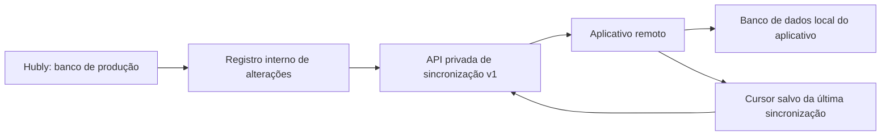

# Integração de Sincronização Remota do Hubly

## Objetivo

Este documento define a estratégia para que um **aplicativo próprio** mantenha uma cópia operacional atualizada da base do Hubly. O aplicativo remoto terá acesso de **somente leitura**, consumindo dados em lote pela API de integração do Hubly. Ele não receberá acesso direto ao banco de dados de produção.

> A sincronização abrangente significa disponibilizar todos os dados operacionais necessários ao novo aplicativo. Senhas, tokens de sessão, credenciais de mensageria, chaves de pagamento e outros segredos nunca são exportados em texto puro.

## Visão da arquitetura



O Hubly permanece como a **fonte oficial** dos dados. O aplicativo remoto lê, compara, inclui e atualiza apenas a sua própria base local. Nenhuma mudança feita no aplicativo remoto volta para o Hubly nesta primeira versão.

Na primeira entrega operacional, a atualização acontece por **nova carga paginada completa**: o módulo remoto percorre todas as entidades e faz `upsert` local. No fim de cada execução, ele deve marcar como removidos localmente os registros daquela entidade que não apareceram no snapshot recém-concluído. Dessa forma, inclusões, alterações e exclusões são sincronizadas com segurança, mesmo antes da otimização incremental.

> Nesta versão, a rota `/changes` responde com orientação para executar nova carga completa. O módulo remoto não deve tratar uma resposta vazia dessa rota como “não houve mudanças”, pois isso poderia ocultar alterações.

| Responsabilidade | Hubly local | Aplicativo remoto |
|---|---|---|
| Criar e alterar dados de negócio | Sim | Não |
| Expor lotes consistentes | Sim | Não |
| Guardar cursor de sincronização | Opcional para auditoria | Sim, obrigatório |
| Inserir/atualizar a base local | Não | Sim |
| Resolver divergência | Fonte oficial | Substitui pelo Hubly |

## Segurança e limites de dados

O novo módulo deve usar uma credencial exclusiva de integração, revogável e separada do login de usuários. A chave não pode ser incluída em aplicativo cliente distribuído publicamente; ela deve ficar somente no servidor do aplicativo remoto.

| Regra | Implementação local proposta |
|---|---|
| Autenticação | `client_id` e segredo de integração armazenado apenas no servidor remoto; o Hubly guarda somente o hash do segredo. |
| Assinatura | Cada chamada recebe `X-Hubly-Timestamp` e `X-Hubly-Signature` em HMAC-SHA256 do método, caminho, data e corpo. |
| Escopo | `sync.read.all` para a integração administrativa que lê todas as empresas. O escopo futuro por empresa será `sync.read.company:{id}`. |
| Transporte | HTTPS obrigatório; nenhuma rota de sincronização aceita HTTP. |
| Auditoria | Cliente, endereço, rota, duração, cursor solicitado, lote entregue e falhas ficam registrados. |
| Limites | Máximo inicial de 500 registros por página e 1.000 eventos incrementais por chamada. |
| Revogação | Desativar a integração invalida chamadas novas imediatamente. A chave deve poder ser rotacionada sem indisponibilidade. |

### Dados que não saem da API

As entidades podem ser exportadas, mas campos confidenciais são removidos ou mascarados antes da resposta. A API jamais deve fazer `SELECT *` diretamente para o consumidor remoto.

| Entidade | Tratamento |
|---|---|
| `users` e `system_users` | Exportar identificação, perfil, papéis e vínculos; nunca senha, hash de senha, sessão ou token de login. |
| `wa_session`, `wa_connection_log` | Não exportar credenciais, QR Code, chaves ou estado de sessão. Apenas indicadores operacionais explicitamente aprovados. |
| `google_calendar_tokens` e `google_calendar_tokens_usuario` | Não exportar tokens OAuth. Exportar, se necessário, somente referência de conta e status de conexão. |
| `tokens_confirmacao` | Não exportar tokens utilizáveis. Exportar somente estado e carimbos de data necessários a relatórios. |
| `push_subscriptions` | Não exportar endpoint, chaves ou dados de entrega. |
| Assinaturas e pagamentos | Exportar status, valores, referências e períodos. Não exportar segredos, webhooks ou dados de cartão. |

## Catálogo de entidades da sincronização

O contrato deve manter o nome lógico das entidades estável mesmo quando a estrutura interna do Hubly evoluir. O aplicativo remoto não deve depender de nomes de colunas ou relacionamentos internos sem passar pela API versionada.

| Grupo | Entidades lógicas cobertas |
|---|---|
| Identidade e empresas | `empresas`, usuários saneados, profissionais, tipos de profissional, permissões, grupos, membros e convites. |
| Cadastros | `clientes`, serviços, vínculos profissional-serviço, meios de pagamento, taxas e configurações. |
| Agenda | agendamentos, itens, pessoas, pagamentos, bloqueios, comissões, cores de status e tokens saneados de confirmação. |
| Financeiro | contas a receber, contas a pagar, categorias, alertas, score, créditos e relatórios derivados permitidos. |
| Pacotes | modelos, itens de modelo, pacotes de clientes, itens, pagamentos e notificações. |
| Automação e comunicação | automações, histórico saneado de envios, exclusões, notificações e Pipeline. |
| Marketing e IA | posts, tipos de conteúdo, métricas, tipos ocultos, insights, análises e base de conhecimento. |
| Administração | planos, assinaturas, uso, alertas de uso, dashboard e chamados, respeitando o mascaramento de segredos. |

## Estratégia local de sincronização

### 1. Registro de alterações

Como nem todas as tabelas possuem o mesmo campo de atualização e algumas exclusões são físicas, a sincronização incremental não deve depender apenas de `updatedAt`. O Hubly deverá registrar cada alteração relevante em uma tabela interna de saída, chamada conceitualmente de `sync_change_log`.

| Campo | Finalidade |
|---|---|
| `cursor` | Número crescente global, usado para retomar a sincronização. |
| `empresa_id` | Empresa dona do dado; nulo apenas para referências globais. |
| `entity` | Nome lógico, por exemplo `appointments`, `clients` ou `package_items`. |
| `record_id` | Identificador do registro no Hubly. |
| `operation` | `upsert` ou `delete`. |
| `occurred_at` | Data/hora UTC da mudança. |
| `schema_version` | Versão do formato daquele evento. |
| `payload` | Representação saneada do registro ou referência para buscá-lo pela API. |

Toda escrita do Hubly que for elegível à integração deve publicar um evento no mesmo fluxo transacional. Assim, o aplicativo remoto recebe tanto criações quanto alterações e exclusões.

### 2. Carga inicial

A primeira carga não usa o log de alterações. Ela cria uma sessão de bootstrap com um ponto de corte (`snapshot_cursor`) e baixa os dados em páginas estáveis. Durante a carga, novas mudanças continuam entrando no log. Ao terminar a última página, o aplicativo remoto passa a consumir os eventos a partir de `snapshot_cursor`.

Ordem recomendada para reduzir falhas de relacionamento:

1. Empresas, referências globais, usuários saneados e profissionais.
2. Clientes, serviços, configurações, meios de pagamento e permissões.
3. Agenda, itens, pagamentos, bloqueios e comissões.
4. Financeiro, Pacotes, Pipeline, automações e histórico saneado.
5. Marketing, métricas, Insights, suporte e demais módulos auxiliares.

### 3. Sincronização incremental

Após o bootstrap, o aplicativo remoto chama a rota de alterações em lote com o último cursor confirmado. Para cada evento recebido, ele faz `upsert` local por `(hubly_entity, hubly_id)` ou marca o registro como excluído quando a operação for `delete`.

O cursor só pode ser salvo **depois** de todo o lote ser confirmado na base remota. Se o processo cair, o mesmo lote será reaplicado de forma idempotente, sem duplicar registros.

### 4. Exclusões e cancelamentos

Uma exclusão ou remoção do Hubly é enviada como um tombstone (`operation: delete`). O aplicativo remoto não deve simplesmente ignorá-la. Ele deve marcar o registro como excluído ou removê-lo conforme a regra de retenção local, preservando a referência para impedir que uma sincronização atrasada o recrie.

Estados de negócio, como `cancelado`, `faltou`, `remarcado`, `concluído` ou `vencido`, são alterações normais de registro e devem chegar como `upsert`, não como exclusão.

## Contrato proposto da API v1

Os caminhos abaixo são a especificação do módulo local a implementar. Eles não expõem SQL nem dados crus do banco.

| Rota | Uso |
|---|---|
| `GET /api/integrations/v1/health` | Confirma disponibilidade, versão e relógio do servidor. |
| `GET /api/integrations/v1/schema` | Retorna versão, catálogo de entidades e campos públicos de cada entidade. |
| `POST /api/integrations/v1/bootstrap` | Cria uma sessão de carga inicial e devolve `snapshotId`, `snapshotCursor` e entidades disponíveis. |
| `GET /api/integrations/v1/bootstrap/{snapshotId}/{entity}?cursor=&limit=` | Entrega uma página estável da entidade durante a carga inicial. |
| `GET /api/integrations/v1/changes?after={cursor}&limit=` | Reservada para a futura otimização incremental; nesta versão orienta executar nova carga completa. |
| `GET /api/integrations/v1/records/{entity}/{id}` | Reconsulta um registro específico e saneado por ID. |

### Formato de resposta de lote

```json
{
  "apiVersion": "v1",
  "snapshotId": "f75f3f...",
  "entity": "appointments",
  "after": 881000,
  "nextCursor": 881500,
  "hasMore": true,
  "records": [
    {
      "id": 881499,
      "empresaId": 1
    }
  ]
}
```

### Autorização da chamada

```http
GET /api/integrations/v1/bootstrap/<snapshotId>/appointments?after=881000&limit=500 HTTP/1.1
Host: hubly.orizontech.com.br
Authorization: Bearer <client_id>.<segredo_da_integracao>
X-Hubly-Timestamp: 2026-08-18T01:40:00.000Z
X-Hubly-Signature: sha256=<HMAC_SHA256_de_METODO_LINHA_CAMINHO_COM_QUERY_LINHA_TIMESTAMP_LINHA_CORPO>
```

## Manual para o módulo remoto

### Pré-requisitos

O módulo remoto precisa de um serviço de servidor próprio, banco de dados local, armazenamento seguro de segredos e acesso HTTPS ao domínio do Hubly. A chave de integração não pode ser instalada no aplicativo mobile ou no navegador de usuários finais.

Cada tabela local sincronizada deve conter, no mínimo, os campos `hubly_id`, `hubly_company_id`, `hubly_updated_at`, `hubly_deleted_at` e `last_synced_at`. A chave única recomendada é `(entity, hubly_id)`.

### Passo 1 — Testar conexão

Chame `GET /health`, valide a assinatura da resposta e confira se a versão `v1` é compatível. Não inicie a carga caso o relógio remoto esteja muito diferente do relógio do Hubly ou a credencial esteja revogada.

### Passo 2 — Criar bootstrap

Chame `POST /bootstrap` uma vez. Guarde `snapshotId` e `snapshotCursor`. A carga deve acontecer por entidade, página e transação local curta. Não tente baixar toda a base em uma requisição.

### Passo 3 — Importar páginas

Para cada entidade, solicite páginas de até 500 registros. Para cada registro recebido, execute `upsert` usando `hubly_id`. Não gere identificadores novos para registros do Hubly; mantenha a origem e o ID de referência.

### Passo 4 — Concluir a reconciliação da entidade

Depois de receber a última página (`hasMore=false`) de uma entidade, marque como removidos na base remota somente os registros dessa entidade que não foram vistos no `snapshotId` atual. Nunca faça essa limpeza antes da última página.

### Passo 5 — Repetir o lote

Em cada execução periódica, inicie novo `bootstrap`, percorra todas as entidades e faça `upsert` local pelos respectivos IDs do Hubly. Uma frequência inicial de 15 minutos é adequada para sincronização em lote e pode ser ajustada conforme o volume.

### Passo 6 — Recuperação

Em caso de falha, repita a mesma página usando o último `after` confirmado. A rotina deve ser idempotente. Caso o snapshot expire, inicie novo bootstrap e só finalize a reconciliação após percorrer todas as páginas da entidade.

### Pseudocódigo de referência

```ts
const snapshot = await hubly.post("/api/integrations/v1/bootstrap");

for (const entity of snapshot.entities) {
  let after = 0;
  const vistos = new Set<number>();
  do {
    const page = await hubly.get(`/api/integrations/v1/bootstrap/${snapshot.snapshotId}/${entity.name}?after=${after}&limit=500`);
    await database.transaction(async (tx) => {
      for (const record of page.records) {
        await tx.upsert(entity.name, record.id, record.empresaId, record);
        vistos.add(record.id);
      }
      await tx.savePageCursor(snapshot.snapshotId, entity.name, page.nextCursor);
    });
    after = page.nextCursor;
    if (!page.hasMore) {
      await database.markMissingAsDeleted(entity.name, vistos);
      break;
    }
  } while (true);
}
```

## Regras operacionais

| Situação | Regra do módulo remoto |
|---|---|
| Registro já existe | Atualizar pelo `hubly_id`; o Hubly vence qualquer divergência. |
| Evento repetido | Reaplicar sem criar duplicidade. |
| Registro excluído | Processar tombstone e não recriar automaticamente. |
| Cursor não encontrado | Registrar erro e executar bootstrap novamente. |
| Chave revogada | Parar sincronização, alertar administrador e não tentar com outra chave automática. |
| Erro temporário | Repetir com atraso progressivo, sem avançar cursor. |

## Plano de implementação local

1. Criar tabelas internas de clientes de integração, chaves hasheadas, escopos, auditoria, snapshots e log de alterações.
2. Criar um catálogo público de entidades e serializadores que removem campos sensíveis.
3. Implementar autenticação, HMAC, rate limit e as rotas `health`, `schema`, `bootstrap`, `bootstrap page` e `changes`.
4. Instrumentar as gravações dos módulos do Hubly para alimentar o log de alterações com `upsert` e `delete`.
5. Validar isolamento, paginação, retomada, exclusões, reprocessamento e rotação de chave.
6. Liberar a integração primeiro em ambiente de teste e depois emitir a credencial de produção para o módulo remoto.

## Critérios de aceite

A primeira versão estará pronta quando o módulo remoto puder iniciar uma carga completa, interrompê-la, retomar sem duplicidade, aplicar alterações incrementais, refletir exclusões e consultar o status de sincronização sem nunca receber segredos ou obter conexão direta com o banco de produção.
