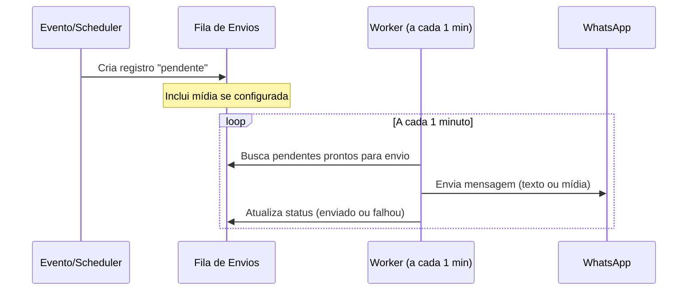

# Design — Melhorias em Automações, Agendamentos e Permissões

## Visão Geral

Este design abrange 9 melhorias no sistema Hubly/Agendei, organizadas em três eixos:

1. **Automações**: diagnóstico completo de triggers (Req 2), modal de debug em tempo real (Req 3), correção de envio de mídia (Req 4), correção da procedure `testarEnvio` (Req 5), automação de renovação de pacotes (Req 9).
2. **Agendamentos**: aba de pacotes no modal de agendamento (Req 1), filtro por profissional no calendário (Req 6).
3. **Permissões**: fluxo de aprovação de bloqueios (Req 7), notificações filtradas por usuário (Req 8).

---

## Req 1 — Aba de Pacotes no Modal de Agendamento

### Comportamento da Interface

Quando o atendente seleciona um cliente no modal de novo agendamento, o sistema verifica se esse cliente possui pacotes ativos com sessões disponíveis. Se sim, uma seção "Pacotes Ativos" aparece logo abaixo da seleção de cliente, antes da etapa de escolha de serviço.

Cada pacote é exibido como um card clicável contendo o nome do pacote, o serviço vinculado e quantas sessões ainda restam. Ao clicar em um card, o sistema preenche automaticamente o serviço correspondente e vincula o item do pacote ao agendamento, poupando o atendente de navegar pela lista de serviços.

Se o cliente não possui pacotes ativos, a seção simplesmente não aparece e o fluxo de agendamento segue como hoje.

### Comportamento do Backend

A query de pacotes ativos já existe (`pacotes.listarAtivosComSessoes`). Não há mudança no backend para este requisito — apenas reorganização da UI para consumir os dados de forma mais acessível.

---

## Req 2 — Diagnóstico Completo dos Triggers de Automações

### Comportamento do Backend

O sistema de automações possui 7 tipos de trigger. Cada um deve funcionar da seguinte forma:

**Triggers de evento (imediatos):** Quando um evento ocorre no sistema (agendamento criado, confirmado, cancelado, concluído, cliente criado, pré-agendamento expirado, pacote renovado), o backend verifica se existe alguma automação ativa para aquele tipo de evento. Se sim, cria imediatamente um registro na fila de envios com status "pendente".

**Triggers baseados em dias (agendados):** O scheduler roda periodicamente e verifica automações do tipo "X dias antes" ou "X dias depois" de um agendamento. Ele calcula a data alvo e, se o horário atual estiver dentro de uma janela de ±15 minutos do horário configurado, enfileira o envio.

**Triggers baseados em horas:** Similar aos de dias, mas o cálculo é feito em minutos a partir do horário exato do agendamento. O scheduler verifica se o momento de disparo já chegou.

**Trigger de aniversário do mês:** O scheduler filtra todos os clientes cujo mês de nascimento corresponde ao mês atual e enfileira envios no horário configurado.

**Trigger de data fixa:** Dispara na data e horário exatos configurados na automação.

**Deduplicação:** Para todos os tipos, o sistema verifica se já existe um envio registrado para a mesma combinação de automação + agendamento (ou automação + cliente, conforme o tipo). Se já existe, o envio duplicado é ignorado silenciosamente.

### Comportamento da Interface

Não há mudanças visuais para este requisito. As correções são internas ao backend.

---

## Req 3 — Modal de Debug de Automações em Tempo Real

### Comportamento da Interface

Na lista de automações, um novo botão "Debug" (com ícone de atividade) fica disponível para administradores. Ao clicar, abre um modal que mostra uma lista em tempo real de todos os envios de automação.

Cada item da lista exibe: data/hora, nome da automação, tipo de trigger, status (pendente, enviado ou falhou), nome do cliente destinatário e, quando aplicável, a mensagem de erro. Itens com status "falhou" aparecem em destaque vermelho, com o detalhe do erro expansível. Envios de teste são identificados com um badge "Teste".

O modal oferece filtros por automação específica, por status e por período (última hora, últimas 24h, últimos 7 dias). A lista se atualiza automaticamente a cada 5 segundos via polling.

### Comportamento do Backend

Uma nova consulta no backend retorna os registros da fila de envios com suporte a filtros por automação, status e período. Os dados incluem informações do envio e da automação associada (nome, tipo de trigger).

---

## Req 4 — Correção do Envio de Mídia na Automação

### Comportamento do Backend

Quando o worker da fila processa um envio pendente, ele agora verifica se a automação possui mídia configurada. Se sim:

- **Imagens** (jpg, jpeg, png, gif, webp): são enviadas como mensagem de imagem no WhatsApp, com o texto da automação como legenda.
- **Documentos** (pdf): são enviados como mensagem de documento, também com o texto como legenda.

Se a URL da mídia estiver inacessível, o sistema envia apenas o texto e registra um aviso. Se o envio da mídia falhar por outro motivo, o registro é marcado como "falhou" com o detalhe do erro.

### Mudança no Banco de Dados

A tabela de histórico de envios ganha um campo para armazenar a URL da mídia diretamente no registro da fila, evitando que o worker precise buscar a automação novamente no momento do processamento.

### Comportamento da Interface

Não há mudanças visuais. A correção é transparente para o usuário.

---

## Req 5 — Procedure de Teste de Envio de Automação

### Comportamento da Interface

Na tela de automações, o administrador pode acionar um teste de envio informando um número de telefone. Ao confirmar, o sistema exibe uma notificação informando que o teste foi enfileirado e pode ser acompanhado no modal de debug.

### Comportamento do Backend

O teste de envio não dispara a mensagem diretamente. Em vez disso, cria um registro na fila de envios com status "pendente" e uma flag indicando que é um teste. As variáveis da mensagem são substituídas por dados de exemplo (nome fictício, serviço exemplo, data/hora exemplo, etc.).

O worker da fila processa o envio de teste normalmente, incluindo mídia se configurada. Isso garante que o teste percorre todo o fluxo real: fila → processamento → envio via WhatsApp.

Se o WhatsApp não estiver conectado no momento do processamento, o envio é marcado como "falhou" com mensagem explicativa.

### Mudança no Banco de Dados

A tabela de histórico de envios ganha um campo booleano para identificar envios de teste.

---

## Req 6 — Filtro por Profissional no Calendário

### Comportamento da Interface

Quando um administrador acessa o calendário, um campo de seleção com busca (autocomplete) aparece no topo, listando os profissionais ativos. Ao selecionar um profissional, o calendário exibe apenas os agendamentos daquele profissional. Ao limpar o filtro, todos os agendamentos voltam a aparecer.

O filtro persiste ao navegar entre meses — o administrador não precisa reselecionar o profissional ao mudar de mês.

Para usuários não-admin, o campo de filtro não aparece, pois o backend já filtra automaticamente pelos agendamentos do profissional vinculado.

### Comportamento do Backend

A consulta de agendamentos passa a aceitar um parâmetro opcional de profissional. Quando fornecido por um admin, filtra explicitamente. A lógica existente de filtro automático para não-admins permanece inalterada.

---

## Req 7 — Fluxo de Aprovação de Bloqueio de Agenda

### Comportamento da Interface

**Para não-admins:** A tela de bloqueios mostra apenas o status das solicitações (pendente, aprovado, recusado). Os botões de "Aprovar" e "Recusar" ficam ocultos. O profissional pode solicitar um bloqueio, mas não pode aprová-lo.

**Para admins:** A tela exibe os botões "Aprovar" e "Recusar" para bloqueios pendentes. Ao aprovar, o profissional solicitante recebe uma notificação. Ao recusar, o admin pode informar um motivo, que é incluído na notificação enviada ao solicitante.

### Comportamento do Backend

Quando um não-admin solicita um bloqueio, o sistema força o status como "pendente" e registra quem solicitou. Uma notificação é enviada para todos os administradores informando a nova solicitação.

As operações de aprovar e recusar verificam se o usuário tem permissão de admin. Se um não-admin tentar aprovar ou recusar via API, recebe um erro de permissão (FORBIDDEN).

Ao aprovar ou recusar, o sistema cria uma notificação direcionada ao profissional que fez a solicitação.

---

## Req 8 — Notificações Filtradas por Usuário

### Comportamento da Interface

**Para admins:** A tela de notificações exibe todas as notificações da empresa, sem filtro.

**Para não-admins:** A tela exibe apenas notificações direcionadas ao profissional vinculado, mais notificações gerais (sem destinatário específico).

Não há mudança visual na tela — a filtragem acontece no backend de forma transparente.

### Comportamento do Backend

A consulta de notificações agora considera o papel do usuário:
- Admin vê tudo da empresa.
- Não-admin vê apenas notificações onde o destinatário é ele mesmo, ou notificações sem destinatário definido (visíveis para todos).

Ao criar notificações de agendamento, o sistema preenche o destinatário com o profissional do agendamento. Ao criar notificações de bloqueio aprovado/recusado, o destinatário é o profissional solicitante.

### Mudança no Banco de Dados

O campo de destinatário na tabela de notificações passa a ser opcional (nullable). Quando vazio, a notificação é visível para todos os admins.

---

## Req 9 — Automação de Renovação e Validade de Pacotes

### Comportamento da Interface

No modal de configuração de pacote, o administrador encontra:
- Um toggle "Habilitar automação de renovação".
- Um campo de data de validade opcional, que aparece quando o toggle está ativado.

Se o toggle estiver desativado, o campo de data de validade fica oculto. Se a data de validade não for preenchida, o pacote não expira por tempo (apenas por sessões).

### Comportamento do Backend

O scheduler verifica periodicamente os pacotes com automação de renovação habilitada:

**Pacote vencendo (por data):** Se o pacote tem data de validade definida, o sistema enfileira um aviso 7 dias antes e outro 1 dia antes do vencimento. Pacotes sem data de validade são ignorados neste trigger.

**Sessões acabando:** Se qualquer serviço do pacote está com exatamente 1 sessão restante, o sistema enfileira um aviso. Funciona independentemente de ter data de validade.

**Deduplicação:** O sistema garante que cada tipo de aviso (7 dias, 1 dia, sessões acabando) é enviado no máximo uma vez por pacote, mesmo que o scheduler rode múltiplas vezes no mesmo dia.

Pacotes com automação desabilitada são completamente ignorados por todos os triggers de renovação.

### Mudança no Banco de Dados

A tabela de pacotes do cliente ganha dois campos: um booleano para habilitar/desabilitar a automação de renovação, e um campo de data para a validade (opcional).

---

## Fluxo Geral de Automações

---

## Tratamento de Erros

| Cenário | Comportamento |
|---|---|
| WhatsApp desconectado ao processar fila | Itens permanecem como "pendente"; ao reconectar, o worker processa automaticamente |
| URL de mídia inacessível | Envia apenas texto, registra aviso |
| Envio de mídia falha | Marca como "falhou" com detalhe do erro |
| Envio pendente expira (>4h) | Worker marca como "falhou" com mensagem "Expirado" |
| Não-admin tenta aprovar/recusar bloqueio | Erro de permissão (FORBIDDEN) |
| Automação inexistente no teste de envio | Erro informando que não foi encontrada |
| Cliente sem telefone em automação | Registro marcado como "falhou" com erro "Telefone ausente" |
| Deduplicação detecta envio existente | Envio ignorado silenciosamente |
| Pacote sem data de validade com automação habilitada | Trigger de vencimento ignorado; trigger de sessões funciona normalmente |
| Pacote com automação desabilitada | Todos os triggers de renovação ignorados |

---

## Propriedades de Corretude

### Propriedade 1: Enfileiramento por evento gera registro pendente

Para qualquer tipo de evento válido e dados de agendamento/cliente válidos, o sistema deve criar um registro na fila com status "pendente" em até 5 segundos após o evento.

### Propriedade 2: Cálculo correto de data alvo para triggers baseados em dias

Para qualquer valor de dias (1 a 365) e horário de disparo válido, a data alvo deve ser calculada corretamente. O envio só deve ocorrer se o horário atual estiver dentro da janela de ±15 minutos.

### Propriedade 3: Cálculo correto de timestamp para triggers baseados em horas

Para qualquer valor de delay em minutos (1 a 1440) e horário de agendamento válido, o timestamp de disparo deve ser calculado corretamente (subtraindo para "antes", somando para "depois").

### Propriedade 4: Filtragem correta de aniversariantes do mês

Para qualquer conjunto de clientes com datas de nascimento variadas, o trigger de aniversário deve selecionar exatamente os clientes cujo mês de nascimento corresponde ao mês atual.

### Propriedade 5: Deduplicação de envios (idempotência)

Para qualquer combinação de automação e agendamento (ou cliente), executar o enfileiramento duas vezes deve resultar em no máximo um registro pendente na fila.

### Propriedade 6: Filtragem correta no modal de debug

Para qualquer combinação de filtros (automação, status, período), os resultados devem conter apenas registros que satisfazem todos os filtros simultaneamente.

### Propriedade 7: Classificação correta de tipo de mídia

Para qualquer URL de mídia com extensão válida: jpg/jpeg/png/gif/webp → envio como imagem com legenda; pdf → envio como documento com legenda.

### Propriedade 8: Envio de teste percorre a fila completa

Para qualquer automação válida e telefone de teste, o teste deve criar um registro na fila que é processado pelo worker normalmente, incluindo mídia se configurada.

### Propriedade 9: Filtro de profissional no calendário

Para qualquer profissional selecionado no filtro, a consulta deve retornar apenas agendamentos daquele profissional. Quando o filtro é limpo, todos os agendamentos devem aparecer.

### Propriedade 10: Bloqueio criado por não-admin sempre tem status pendente

Para qualquer solicitação de bloqueio feita por um não-admin, o registro deve ter status "pendente", independentemente dos dados enviados.

### Propriedade 11: Autorização de aprovação/recusa de bloqueios

Para qualquer não-admin, tentativas de aprovar ou recusar bloqueios via API devem resultar em erro FORBIDDEN.

### Propriedade 12: Visibilidade de notificações por papel

Admin vê todas as notificações da empresa. Não-admin vê apenas notificações direcionadas a ele ou sem destinatário definido.

### Propriedade 13: Atribuição correta de destinatário em notificações

Notificações de agendamento devem ter como destinatário o profissional do agendamento. Notificações de bloqueio aprovado/recusado devem ter como destinatário o profissional solicitante.

### Propriedade 14: Trigger pacote_vencendo dispara nos dias corretos

Para pacotes com automação habilitada e data de validade definida, o sistema deve enfileirar avisos exatamente 7 dias e 1 dia antes do vencimento. Pacotes sem data de validade ou com automação desabilitada não devem gerar envios.

### Propriedade 15: Trigger sessoes_acabando dispara quando qualquer serviço tem 1 sessão

Para pacotes com automação habilitada, o trigger deve disparar se e somente se pelo menos um item do pacote tem 1 sessão restante. Pacotes com automação desabilitada não devem gerar envios.

### Propriedade 16: Deduplicação de avisos de renovação de pacotes

Para qualquer pacote e tipo de aviso, executar o scheduler duas vezes no mesmo dia deve resultar em no máximo um registro pendente para cada combinação.
